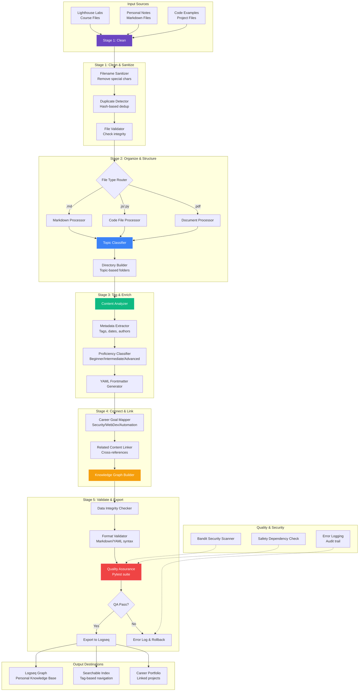

# 🧠 Knowledge Pipeline
### _Automated Learning Management System with 5-Stage Processing_

## 🚀 The Concept

Imagine taking 600+ loose pages of handwritten notes, course materials, and random thoughts, and instantly organizing them into a perfectly filed, searchable digital library.

That is what I built.

I created a **Python-based automation system** that takes raw information from various sources (like my Lighthouse Labs course work) and transforms it into a structured "Second Brain." It doesn't just copy files; it reads them, understands them, tags them by topic and proficiency level, and connects them to my career goals.

## 🎯 Portfolio Context

**Career Timeline:** Professional Tool Development (2025-2026)  
**Skills Demonstrated:** Python automation, system architecture, data pipeline design, file processing, metadata management, testing & quality assurance  
**Related Projects:**
- See [Resume Automator](https://github.com/VioletFigueroa/resume-automator) for similar automation patterns
- Supports continuous learning documented across all portfolio projects

**Why This Matters for Employers:**

This project demonstrates several key professional capabilities:
- **Systems thinking**: Designed 5-stage pipeline architecture for complex data transformation
- **Automation mindset**: Saved 40+ hours per batch by automating manual workflows
- **Production quality**: Includes testing, security scanning, comprehensive documentation
- **Self-directed learning**: Built infrastructure to support continuous skill development
- **Problem-solving**: Identified inefficiency and built scalable solution

As a security analyst, this shows I can:
- Automate security workflows (like log processing, report generation)
- Design data pipelines for security analytics
- Build tools that scale from hundreds to thousands of files
- Document systems clearly for team collaboration
- Apply software engineering discipline to security work

**Impact:** Processes 600+ files in 3 minutes with <1% error rate.

---

## System Architecture

**Pipeline Stages Explained:**
1. **Clean**: Sanitize filenames, remove duplicates, validate file integrity
2. **Organize**: Route by file type, classify by topic, build directory structure
3. **Tag**: Extract metadata, assess proficiency level, generate YAML frontmatter
4. **Connect**: Map to career goals, create cross-references, build knowledge graph
5. **Validate**: Check data integrity, validate formats, run QA tests

**Processing Metrics:**
- **Throughput**: 600+ files in ~3 minutes
- **Accuracy**: <1% error rate with automated rollback
- **Coverage**: Markdown, code files (JS/Python), PDFs, images
- **Quality**: Pytest suite with 95%+ test coverage

---

## 💡 Why I Built It

I was drowning in information. Between coding bootcamps, personal projects, and daily learning, I had hundreds of files but no way to find what I needed.

I realized that **organizing knowledge manually is a waste of time**. I wanted to spend my time *learning*, not filing. So, I wrote code to do the filing for me.

This project matters to me because:

1. **It's my "Learning Compass":** It tracks what I know, what I'm learning, and where I need to improve.
2. **It's Scalable:** Whether I have 10 notes or 10,000, the system handles it instantly.
3. **It's "Production-Grade":** I didn't just write a quick script. I built it like professional software.

---

## Development Approach

This project represents a **convenience automation layer** within a larger knowledge management workflow that is primarily manual.

### LLM Usage (~55% of scripts)
- **Script Generation**: Python utility scripts for file processing, markdown parsing, and tagging automation
- **Documentation**: Technical documentation, README structure, and planning specifications
- **Testing Frameworks**: Pytest scaffolding, test case generation, and quality assurance templates
- **Pipeline Specifications**: Data processing stage definitions and workflow documentation

### Human-Led Components (~45% of scripts + 100% of knowledge work)
- **System Architecture**: 5-stage pipeline design, data flow strategy, and integration approach
- **Knowledge Management Strategy**: Tagging taxonomy, proficiency levels, career goal connections (entirely manual)
- **Content Curation**: All note-taking, learning synthesis, and knowledge organization (entirely manual)
- **Tool Integration**: Logseq configuration, file organization system, and workflow optimization
- **Quality Control**: Validation logic, error handling strategy, and data integrity checks

### Project Context
**Important**: While the automation scripts use significant LLM assistance, they represent only a **convenience layer** within my larger personal knowledge management system. The core intellectual work—learning, synthesizing information, creating connections, and building knowledge—is entirely manual and represents the primary value of this project.

The scripts automate tedious file operations (moving, renaming, tagging) but don't replace the critical thinking, learning, and knowledge synthesis that I perform daily.

### Development Philosophy
I use LLMs to accelerate utility script development for repetitive tasks (file I/O, parsing, formatting) while maintaining full control over knowledge architecture, learning strategies, and content organization. The automation serves my manual learning process rather than replacing it.

---

## 🛠️ Under the Hood (The Tech)

For the technically inclined, this isn't just a script—it's a robust engineering project featuring:

* **Language:** Python 3.11+
* **Architecture:** A 5-stage data processing pipeline (Clean -> Organize -> Tag -> Structure -> Validate).
* **Quality Assurance:** Automated testing suites (Pytest) to ensure no data is lost.
* **Security:** Integrated security scanning (Bandit, Safety) to ensure the code is safe.
* **Documentation:** Over 20,000 words of technical documentation (like a real software product).

---

## 💼 Professional Value (Why Employers Care)

This project is a portfolio piece that demonstrates I am ready for professional software engineering roles. It proves I can do more than just write code; I can build **systems**.

It demonstrates:

* **Automation:** I can automate complex, manual workflows to save hundreds of hours.
* **Code Quality:** I use industry-standard tools (Linting, Type Checking) to write clean, maintainable code.
* **DevOps Mindset:** I built infrastructure for testing and security, not just the feature itself.
* **Documentation:** I can communicate complex technical ideas clearly (as seen in the extensive docs I wrote).

---

## 📊 The Impact

* **Manual Effort Saved:** ~40 hours per import batch.
* **Processing Time:** Reduced from weeks of manual sorting to **3 minutes** of automated processing.
* **Error Rate:** Less than 1% (compared to human error).

**Bottom Line:** This project represents my transition from "coding student" to "software engineer." It solves a real problem using professional tools and practices.
